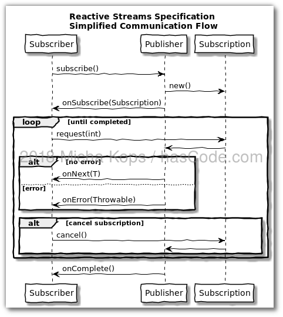
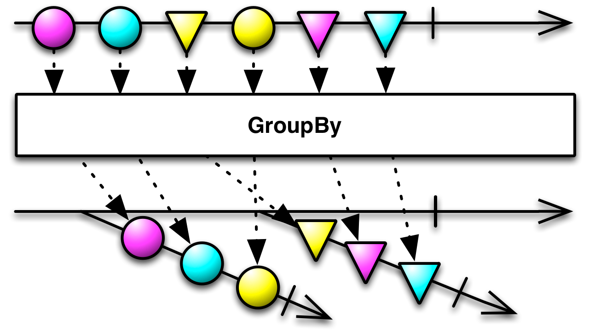
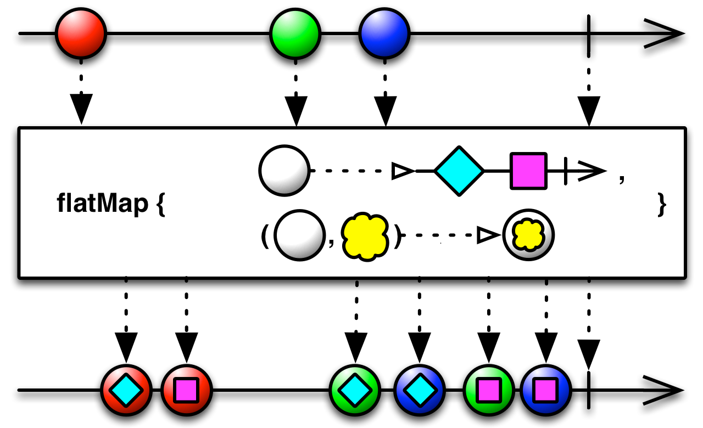

@title[Introduction]
 

## @color[#cc6699](RxJava 2.0)
Reactive Extensions for the JVM
---

RxJava offre une manière élégante pour implémenter du code asynchrone.
* Callback : Complexité dans l'enchainement de callBack (Callback Hell)

```java
service.getData(dataA -> {
    service.getData(dataB -> {
        service.getData(dataC -> {
            // ...
        });
    });        
});
```
 * Future : Peuvent bloquer le code trop tôt ( appel à la méthode get) 
+++

@size[0.5em](RxJava est basé sur le patron de conception Observateur : L'objet observé envoie un signal à des composants qui jouent le rôle d'observateurs. En cas de notification, les observateurs effectuent alors l'action adéquate en fonction des informations qui parviennent depuis les modules qu'ils observent.)  
 
   

+++
Un Observable peux être compris comme un Runnable, il va contenir une méthode qui va être executé dans un Thread différent.

```java
Observable<User> userObservable = Observable.create(new Observable.OnSubscribe<User>() {
            @Override
            public void call(Subscriber<? super Object> subscriber) {
                 
                //je peux par exemple faire un appel reseau bloquant
                User user = webservice.getUser("toto");
 
                //une fois l'objet récupéré, il faut l'envoyer au notifieur,
                subscriber.onNext(user);
 
                //puis dire au notifieur que nous avons finit
                subscriber.onCompleted();
            }
        });
```
+++
@div[left-100]
Une fois nos opérations longues terminées, nous souhaitons récupérer le résultat, pour cela nous utiliserons des Subscribe  
@divend
```java
userObservable.subscribe(new Subscriber<User>(){
     public void onNext(Object result) {
         //appelée à chaque fois que l'observable reçoit un objet User
     }
 
     public void onComplete() {
         //appelée lorsque l'observable a finit d'envoyer l'ensemble des objets User
     }
 
     public void onError(Throwable error) {
     }
});
```
---
### Le Manifeste Réactif  
https://www.reactivemanifesto.org/fr

- Disponible : Le système répond rapidement en toutes circonstances.
- Résilient : Le système reste disponible en cas d'erreur.
- Souple : Le système reste disponible indépendemment de la charge de travail

+++

- Orientés messages (message-driven) : Le système utilise le passage de message asynchrones
entre ses composants afin de profiter de l'élasticité et  de la répartition des charges en appliquant la contre-pression ( back-pressure )
+++
### Reactive Streams
@size[0.4em](Une initiative qui essaye de normaliser le traitement asynchrone des flux avec une contre-pression non bloquante.)  
@size[0.4em](RxJava2 implémente cette spécification.)


+++
### Contre Pression (Back-pressure)


---
### Types d'Observables

| Type                        | Cas d'usage                                                    |
|-----------------------------|----------------------------------------------------------------|
| @size[0.6em](*Single*)      | @size[0.6em](Opération asynchrone qui retourne 1 résultat)     |
| @size[0.6em](*Maybe*)       | @size[0.6em](Opération asynchrone qui retourne 0 ou 1 résultat) |
| @size[0.6em](*Completable*) | @size[0.6em](Opération asynchrone qui ne retourne aucun résultat. Indique la fin d'observation.) | 
| @size[0.6em](*Observable*)  | @size[0.6em](Séquence de données sans contre-pression) |
| @size[0.6em](*Flowable*)    | @size[0.6em](Séquence de données avec contre-pression) |

   
---
### Parallélisme dans RxJava 2.0
#### Schedulers
@size[0.6em](Les Schedulers permettent de lancer les opérations des *Observables* sur des threads différents.)

| Type                        | Cas d'usage                                                    |
|-----------------------------|----------------------------------------------------------------|
| @size[0.5em](*IO*)      | @size[0.5em](Utilisé pour les opération I/O  : requêtes réseau, opération FS)     |
| @size[0.5em](*Computation *)       | @size[0.5em](Le nombre de thread dépend du nombre de coeurs de la machine : mobile, serveur ..., optimisé pour les calculs rapides.)|
| @size[0.5em](*NewThread *) | @size[0.5em](Création d'un nouveau thread sans recyclage, à utilser avec modération.) | 
+++  

| Type                        | Cas d'usage                                                    |
|-----------------------------|----------------------------------------------------------------|
| @size[0.5em](*Single *)  | @size[0.5em](Crée un seul thread) |
| @size[0.5em](*Trampoline*)    | @size[0.5em](Exécute le code sur le thread courant) |
| @size[0.5em](*Executor Scheduler*)    | @size[0.5em](Scheduler où on peut configurer la taille du pool de thread. ) |


+++
### Parallélisme dans RxJava 2.0
#### ObserveOn:
Cette opération modifie le thread d'exécution de tout les méthodes qui la succèdent.  

```java
just("Some string")  //UI
 .map(str -> str.length()) //UI
 .observeOn(Schedulers.computation) // changing the thread
 .map(length -> 2 * length) // Computation
 .subscribe(number -> log.debug("Number {}", number)); // Computation
```

@[1-2](Exécuiton du code dans le thread de l'interface utilisateur)
@[3](Modification du thread d'exécution)
@[4-5](Exécution du code dans le thread de calcul)  

+++
### Parallélisme dans RxJava 2.0
#### SubscribeOn:
Cette opération affecte le thread responsable de la souscription à l'observable.
```java
just("Some String") // Computation
  .map(str -> str.length()) // Computation
  .map(length -> 2 * length) // Computation
  .subscribeOn(Schedulers.computation()) // -- changing the thread
  .subscribe(number -> Log.d("", "Number " + number));// Computation
 ```

+++
 ### Parallélisme avec flatMap et groupBy  
 #### GroupBy
 @size[0.7em](Cette méthode regroupe les éléments émis par un *Observable* suivant un critère de sélection spécifique)  
 
  

+++
 ### Parallélisme avec flatMap et groupBy  
 #### FlatMap
  @size[0.7em](FlatMap prends chaque élément de chaque stream et  lui applique une transformation  [la partie *map* ] , ensuite elle va combiner tous les streams dans un stream destination [ la partie *flat*] )   
  
  

---
### Migration des alertes avec RxJava2
#### Processus de migration : 
   @size[1em](La migration des alertes consiste à transformer les alertes Deveryloc  du XML vers Json.)
 
   @size[0.7em](Le processus de migration :) 
   - @size[0.7em](Lecture des coordonnées clients à partir d'un fichier CSV.)
   - @size[0.7em](Création de l'api Deverygo et lecture de l'UO des alertes depuis Geohub)
   - @size[0.7em](Transformation de l'UO des alertes en Json)
   - @size[0.7em](Ecritre de l'UO dans Geohub.)
 
+++
@div[left-50]  
 @size[1.5em](Problème)  
@size[0.75em](Le batch de migration doit être implémenté en Java 6 à cause de la dépendance Xstream)
@divend

@div[right-50]  
@size[1.5em](Solution)
   
@divend
+++
<div style="text-align: left">

@size[1em](Problème)   
@size[0.7em](Les appels à Geohub en lecture et écriture sont bloquants.)    
@size[1em](Solution)  
@size[0.7em](La solution est d'encapsuler l'api bloquante dans une api *réactive*)
</div>  

| Type d'opération            | Signature synchrone   | Signature Rx | Example d'utilisation |
|-----------------------------|-----------------------|--------------|------------------------|
| @size[0.5em](Opération qui ne retroune aucun résultat)  | @size[0.5em](void x()) | @size[0.5em](Completable x()) | @size[0.5em](flush())|
| @size[0.5em](Opération qui retourne un seul résultat)   | @size[0.5em](T x()) | @size[0.5em](Single<T> x())| @size[0.5em](get())|
| @size[0.5em](Opération qui retourne 0  *null* ou 1 résultat)    | @size[0.5em](T x() ou Optional<T> x()) |@size[0.5em](Maybe<T> x() or Single<Optional<T>> x())| |

+++
### Création d'un Objet Flowable
to do 

+++
### Parallélisme du traitement des Alertes
todo 

 